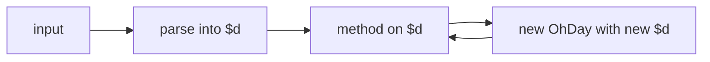

# {{ $frontmatter.title }}

Before diving into individual methods, this page sketches ohday's overall design. The library is small; the rest of the guide just enumerates what each piece does.

## Design Philosophy

Four commitments shape every API decision:

- **Immutable.** Every method returns a new OhDay. Nothing is mutated, ever.
- **Chainable.** All transformations compose with `.`.
- **Short.** Method names are one or two characters where possible.
- **Zero dependencies.** Nothing to vendor at runtime.

These four together produce a library that is small enough to vendor inline, fast enough to call in tight loops, and predictable enough to reason about without reading the source.

## Mental Model



An OhDay instance wraps a single `Date` in the internal field `$d`. Every method reads that field, performs some computation, and returns a new OhDay with its own `$d`. The wrapper is a thin facade over the JavaScript `Date`, with parsing, formatting, and plugin extensions layered on top.

You never read `$d` from application code. Reach the value through the getters, the formatted string through `p()`, and the underlying Date through `pd()`.

## Flag

`OhDayFlag` is the union of time units that appear across the API as method parameters:

| Flag | Unit               | Note                                        |
| ---- | ------------------ | ------------------------------------------- |
| `y`  | year               |                                             |
| `M`  | month              | 1 to 12, not 0 to 11 like the native `Date` |
| `w`  | week (day of week) | 0 is Sunday, 6 is Saturday                  |
| `d`  | day                |                                             |
| `h`  | hour               | 0 to 23                                     |
| `m`  | minute             |                                             |
| `s`  | second             |                                             |
| `ms` | millisecond        |                                             |

Flags are used wherever a method asks "which time unit?". Examples: `.c("M", 2)` changes the month, `.add("d", 10)` adds days, `.lt(target, "y")` compares by year.

Two flags deserve attention because they differ from intuition:

- `M` is month, not `m`. Lowercase `m` is minute.
- `w` is the day of week (0 to 6), not a unit of duration. Methods that accept `w` treat it as a delta on `d`, so `c("w", 0)` lands on Sunday and `cs("w")` jumps to the start of the week.

## Token

`OhDayToken` is the union of format tokens that appear in format strings:

| Token  | Output              | Example |
| ------ | ------------------- | ------- |
| `YYYY` | 4-digit year        | 2023    |
| `YY`   | 2-digit year        | 23      |
| `MM`   | 2-digit month       | 10      |
| `M`    | 1 or 2-digit month  | 10      |
| `DD`   | 2-digit day         | 01      |
| `D`    | 1 or 2-digit day    | 1       |
| `HH`   | 2-digit hour        | 12      |
| `mm`   | 2-digit minute      | 30      |
| `m`    | 1 or 2-digit minute | 30      |
| `ss`   | 2-digit second      | 45      |
| `s`    | 1 or 2-digit second | 45      |
| `SSS`  | 3-digit millisecond | 678     |

Tokens are used by `p(fmt)` to produce output and by `od(str, fmt)` to parse input. Both directions share the same vocabulary.

## Scope and Unit

These two terms sound similar but mean different things:

- **Scope** is the time dimension an operation acts on. It is the first parameter of `c`, `cs`, `ce`, `add`, `sub`, `len`, and the optional second parameter of comparison methods. `c("M", 2)` operates on the month scope.
- **Unit** is the measurement unit of the result. It is the optional second parameter of `diff` and `len`. `diff(target, "d")` returns the difference in days.

| Method                        | First param is | Second param is   |
| ----------------------------- | -------------- | ----------------- |
| `c` `cs` `ce`                 | scope          | value or unitless |
| `add` `sub`                   | scope          | offset            |
| `len`                         | scope          | unit              |
| `diff`                        | target         | unit              |
| `eq` `lt` `gt` `le` `ge` `bt` | target         | scope (optional)  |

Both parameters accept the same `OhDayFlag` values; the difference is purely semantic.

## Internal Fields

Fields prefixed with `$` are internal state and are not part of the public surface:

| Field | Type      | Set by                    | Purpose                                           |
| ----- | --------- | ------------------------- | ------------------------------------------------- |
| `$d`  | `Date`    | constructor, every method | the underlying `Date` object                      |
| `$iw` | `boolean` | `isoWeek` plugin          | ISO week override that propagates along the chain |
| `$i`  | `boolean` | `od.use`                  | plugin installation guard                         |

These exist for plugin authors who need to read or write internal state. Application code should treat them as read-only.

## Plugin System

A plugin is a function that receives the OhDay class and the od factory, then mutates the class prototype to add new methods. The factory exposes a `use` method that runs the plugin once and guards against duplicate installation:

```ts
import type { OhDay, OhDayFactory, OhDayPlugin } from "@xtwis/ohday"

const myPlugin: OhDayPlugin = (instance: typeof OhDay, factory: OhDayFactory) => {
  instance.prototype.tomorrow = function () {
    return this.add("d", 1)
  }
}

od.use(myPlugin)

const t = od("2023-10-01").tomorrow()
console.log(t.s) // "2023-10-02 00:00:00"
```

To make the new method visible to TypeScript, the plugin file augments the module:

```ts
declare module "@xtwis/ohday" {
  interface OhDay {
    tomorrow: () => OhDay
  }
}
```

See the [Fullname Plugin](../plugin/fullname.md) and [ISO Week Plugin](../plugin/iso-week.md) for complete examples.

## Next

- [Input](./input.md) for the five ways to construct an OhDay.
- [Change](./change.md) for `c`, `cs`, and `ce`.
- [Calculation](./calculate.md) for `add`, `sub`, `diff`, and `len`.
