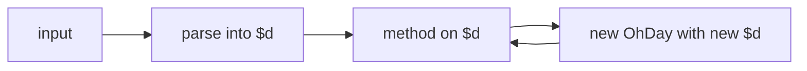

# {{ $frontmatter.title }}

在逐个讲解方法之前, 本页勾勒 ohday 的整体设计. 这个库很小, 指南的其余部分只是在枚举每个部分能做什么.

## 设计哲学

四个承诺决定每一个 API 选择:

- **不可变.** 每个方法都返回新的 OhDay. 永远不会修改原对象.
- **可链式.** 所有变换都能用 `.` 组合.
- **短命名.** 方法名能压到一两个字符就压到一两个字符.
- **零依赖.** 运行时不需要打包任何第三方代码.

这四点共同构成一个库: 小到可以内联, 快到可以在紧循环里调用, 简单到不看源码也能推断行为.

## 心智模型



OhDay 实例把一个 `Date` 包装在内部字段 `$d` 里. 每个方法读取这个字段, 做一次计算, 返回一个带新 `$d` 的新 OhDay. 这个包装层是 JavaScript `Date` 之上的一个薄壳, 上面叠了解析, 格式化和插件扩展.

应用代码不要直接读 `$d`. 取值走 getter, 取格式化字符串走 `p()`, 取底层 Date 走 `pd()`.

## Flag

`OhDayFlag` 是 API 中作为方法参数出现的时间单位的联合:

| Flag | 单位      | 说明                              |
| ---- | --------- | --------------------------------- |
| `y`  | 年        |                                   |
| `M`  | 月        | 1 到 12, 不是原生 Date 的 0 到 11 |
| `w`  | 周 (周几) | 0 是周日, 6 是周六                |
| `d`  | 日        |                                   |
| `h`  | 时        | 0 到 23                           |
| `m`  | 分        |                                   |
| `s`  | 秒        |                                   |
| `ms` | 毫秒      |                                   |

Flag 用在所有问 "哪个时间单位?" 的方法里. 例如 `.c("M", 2)` 改月, `.add("d", 10)` 加日, `.lt(target, "y")` 按年比较.

有两个 Flag 跟直觉不同, 需要单独提一下:

- `M` 是月, 不是 `m`. 小写 `m` 是分.
- `w` 是周几 (0 到 6), 不是周这个时长单位. 接受 `w` 的方法把它当成对 `d` 的偏移, 所以 `c("w", 0)` 落到周日, `cs("w")` 跳到本周起点.

## Token

`OhDayToken` 是出现在格式串里的格式 token 联合:

| Token  | 输出     | 示例 |
| ------ | -------- | ---- |
| `YYYY` | 4 位年   | 2023 |
| `YY`   | 2 位年   | 23   |
| `MM`   | 2 位月   | 10   |
| `M`    | 1-2 位月 | 10   |
| `DD`   | 2 位日   | 01   |
| `D`    | 1-2 位日 | 1    |
| `HH`   | 2 位时   | 12   |
| `mm`   | 2 位分   | 30   |
| `m`    | 1-2 位分 | 30   |
| `ss`   | 2 位秒   | 45   |
| `s`    | 1-2 位秒 | 45   |
| `SSS`  | 3 位毫秒 | 678  |

Token 被 `p(fmt)` 用来生成输出, 也被 `od(str, fmt)` 用来解析输入. 双向共用同一套词汇.

## Scope 和 Unit

这两个词听起来相近, 但含义不同:

- **Scope** 是操作作用的时间维度. 它是 `c`, `cs`, `ce`, `add`, `sub`, `len` 的第一个参数, 也是比较方法可选的第二个参数. `c("M", 2)` 作用在月这个 scope 上.
- **Unit** 是结果的度量单位. 它是 `diff` 和 `len` 可选的第二个参数. `diff(target, "d")` 返回以天为单位的差.

| 方法                          | 第一个参数 | 第二个参数        |
| ----------------------------- | ---------- | ----------------- |
| `c` `cs` `ce`                 | scope      | value 或 unitless |
| `add` `sub`                   | scope      | 偏移量            |
| `len`                         | scope      | unit              |
| `diff`                        | target     | unit              |
| `eq` `lt` `gt` `le` `ge` `bt` | target     | scope (可选)      |

两个参数都用同一套 `OhDayFlag` 值, 区别只在语义.

## 内部字段

以 `$` 开头的字段是内部状态, 不属于公开 API:

| 字段  | 类型      | 设置方           | 用途                    |
| ----- | --------- | ---------------- | ----------------------- |
| `$d`  | `Date`    | 构造器, 每个方法 | 底层 `Date` 对象        |
| `$iw` | `boolean` | `isoWeek` 插件   | 沿链传播的 ISO 周覆盖位 |
| `$i`  | `boolean` | `od.use`         | 插件安装守卫            |

这些字段是给插件作者读/写内部状态用的. 应用代码应当视为只读.

## 插件机制

插件是一个函数, 接收 OhDay 类和 od 工厂, 然后修改类的原型来添加新方法. 工厂暴露一个 `use` 方法, 运行插件一次, 并防止重复安装:

```ts
import type { OhDay, OhDayFactory, OhDayPlugin } from "@xtwis/ohday"

const myPlugin: OhDayPlugin = (instance: typeof OhDay, factory: OhDayFactory) => {
  instance.prototype.tomorrow = function () {
    return this.add("d", 1)
  }
}

od.use(myPlugin)

const t = od("2023-10-01").tomorrow()
console.log(t.s) // "2023-10-02 00:00:00"
```

为了让新方法在 TypeScript 里可见, 插件文件需要扩展模块:

```ts
declare module "@xtwis/ohday" {
  interface OhDay {
    tomorrow: () => OhDay
  }
}
```

完整示例见 [Fullname 插件](../plugin/fullname.md) 和 [ISO Week 插件](../plugin/iso-week.md).

## 下一步

- [Input](./input.md): 五种构造 OhDay 的方式.
- [Change](./change.md): `c`, `cs`, `ce`.
- [Calculation](./calculate.md): `add`, `sub`, `diff`, `len`.
